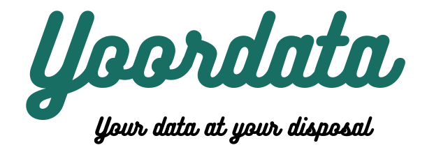

# Proyecto Final IronHack por Jaime Bloch

  

En este proyecto vamos a extraer la información proporcionada por **Google Takeout** y con caracter personal mostraremos en una app de **Streamlit** información, gráficos y mapas que resummen el uso que hacemos de las aplicaciones de Google.

Simplemente descargándote tu información de Google Takeout; con solo un click podras visualizar en una página web las páginas que más visitas, todos los lugares en los que has estado en los últimos años, tus valororaciones realizadas a través de googlel, tus juegos y películas favoritas y una muestra de las tus audios que Google guarda cuidadosamente. "OK google, ahora sé que sabes lo que te pregunto".

El objetivo de este proyecto es tomar conciencia de la gran cantidad de información que tiene las corporaciones sobre nosotros para poder empezar a tomar el control de nuestros datos.
   
   
> Herramientas utilizadas:
   > - **wordcloud** --> visualización de peso de palabras
   >
   > - **seaborn y matplotlib** --> visualización de gráficos
   >
   > - **folium** --> visualización de mapas
   >
   > - **streamlit** --> creación de app de visualización
   >
   > - **ejecutable .sh** 
   >
   > - **pandas, numpy y json** --> tratamiento de datos
